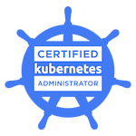
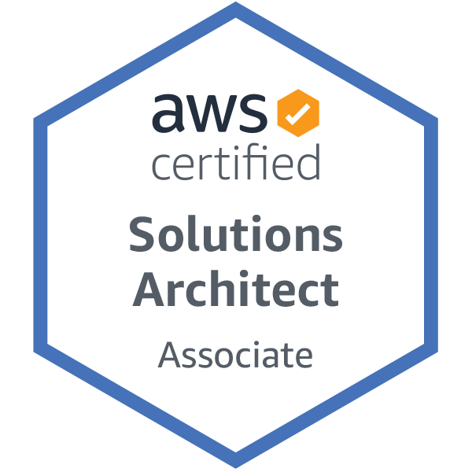

# Karol Szymanowski
[public.szymanowski@gmail.com](mailto:public.szymanowski@gmail.com) - [LinkedIn](https://www.linkedin.com/in/karol-sz/) - [Github](https://github.com/tetrash)
> I am a self-taught programmer with two years of professional experience in creating web applications. I am a team player who is very interested in creating a enjoyable work environment by writing maintainable code, sharing experience or implementing good DevOps practices and being positive.

## WORK EXPERIENCE

### Node.js developer at [Netguru](https://netguru.com)
*`06.2019 - now`*
> I've been involved in numerous projects for clients in the real estate, medical and non-profit industries. My responsibilities range from developing, testing and maintaining APIs to evaluating projects, advising on potential technologies, or participating in the recruitment process.
>
> Keywords: `Node.js` `Typescript` `AWS` `GCP` `Kubernetes` `Graphql` `DevOps` `Serverless`

### Junior fullstack developer at [MDBootstrap](https://mdbootstrap.com)
*`10.2018 - 06.2019`*
> I was responsible for creating and maintaining a tool that enables code execution in browsers. This tool was mainly used by the support team to debbug and fix product problems better and faster, but was also used as a marketing tool to show the product's potential.
>
> Keywords: `Node.js` `Typescript` `Angular` `Jenskins` `PHP`

## SKILLS

**Programming:** `Node.js` `Typescript` `Graphql` `Event-driven architecture` `Hexagonal architecture` `Serverless`

**Devops:** `Azure devops` `CircleCI` `Terraform` `Pullumi` `Kubernetes`

**Databases, queues & message brokers:** `Mysql/Mariadb` `Postgres` `MongoDB` `Redis` `Rabbitmq`

**AWS services:** `RDS` `DynamoDB` `Datasync` `Api gateway` `Amplify` `EKS` `SQS` `SNS` `Kinesis` `S3` `Cognito` `Lambda` `EC2`

**GCP services:** `Firebase` `GKE` `Cloud storage` `Cloud functions` `Cloud sql`

**Projects & teams:** `Working in distributed team` `Agile` `Scrum`

## CERTIFICATES

## PROJECTS

#### [Highly available kubernetes cluster runnning on raspberry pi](https://github.com/tetrash/k8s-rpi-cluster-presentation)
> I built a kubernetes cluster that runs on several raspberry pi and serves as my personal sandbox where I deploy my projects for a fraction of the cost of a cloud solution. I used ansible and k3s to automate the entire process and tools such as helm, prometheus or dex to improve monitoring, access and cluster management.
